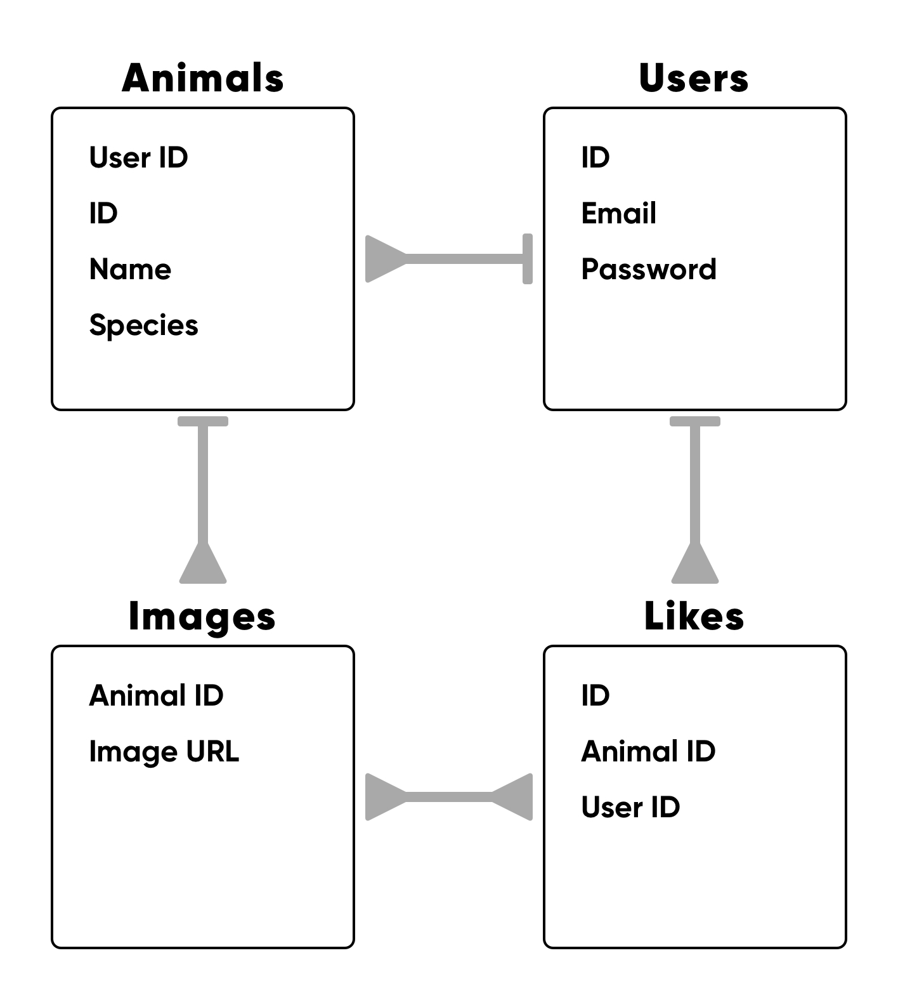

# 🐱 Pet Off 🐕

A full stack app that aims to display some of the best pet pictures on the internet as decided by users. 

## To use

1. Sign in or sign up
2. Select option *pet off* to 'pet' your favourite animal of the 2 generated
3. Or select *upload* to upload or edit pics of your pet

## Tech stack

* Ruby 
* Sinatra 
* ActiveRecord
* JavaScript 
* Markup (HTML & CSS)

## Database schema

## Challenges

* Learning ActiveRecord capabilities and syntax
* File edits and updates via Sinatra
* Querying across multiple tables 

## Improvements 
(where do I start)

* To support video uploads 
* Allow users to upload multiple images of one pet
* Restructure schema and query to the above
* Email confirmation 
* Migrate uploaded media to S3 storage
* More thoughful user journey design 
* Mobile compatibility 
* Refactoring code 

